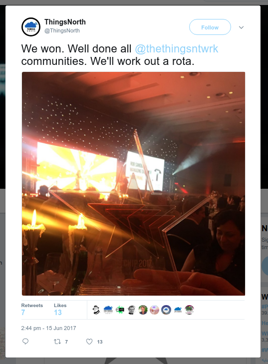
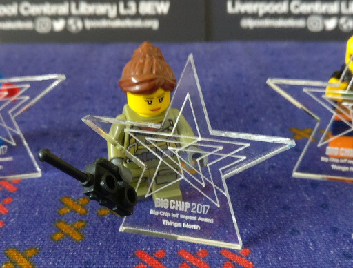

#Little Big Chip Award

When Things north won the IoT Impact Award at the 2017 Big Chip Awards, 
they were presented with a single trophy. But, as the official trophy is 
made from laser cut and engraved acrylic, this means creating more is 
a problem that can be solved… with lasers!

Rather than create a perfect replica, this version is just a single 
layer, intended to be cut and engraved on the reverse of a clear 
acrylic sheet. 

 * [Source SVG](mini_award.svg)
 * [EPS format](mini_award.eps)
 * [As PDF](mini_award.dxf)

While the file is sized to fit on an A4 sheet size, it can be scaled 
down to a small size (~5cm square) and still be legible.

